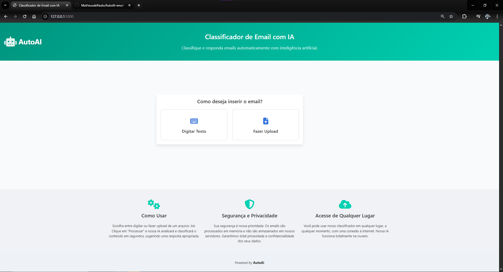

# 🤖 AutoAI: Classificador de Email com IA

## Visão Geral do Projeto

Este projeto demonstra uma aplicação web minimalista e eficiente para classificação automática de e-mails e sugestão de respostas, utilizando o poder da Inteligência Artificial. Desenvolvido com Flask para o backend e uma interface web moderna com Bulma CSS e JavaScript no frontend, o **AutoAI** oferece uma solução prática para gerenciar o fluxo de mensagens, categorizando-as como 'Produtivas' ou 'Improdutivas' e fornecendo respostas contextuais.

O objetivo principal é otimizar a triagem de e-mails, permitindo que usuários ou equipes de suporte respondam de forma mais rápida e consistente, liberando tempo para tarefas de maior complexidade.

## Demonstração do Projeto

Uma prévia visual da aplicação em funcionamento:



## 🚀 Aplicação Online

A versão de produção desta aplicação está hospedada no Hugging Face Spaces e pode ser acessada através do link no topo desta página.

## Funcionalidades Chave

- **Classificação Inteligente:** Utiliza um modelo de `zero-shot classification` da Hugging Face para categorizar e-mails sem a necessidade de treinamento prévio com dados específicos do domínio.
- **Sugestão de Respostas:** Utiliza um modelo de geração de texto para fornecer respostas contextuais baseadas na categoria identificada pela IA.
- **Interface Amigável:** Design responsivo e intuitivo, permitindo a inserção de e-mails via digitação de texto ou upload de arquivo `.txt`.
- **Feedback Visual:** Animações e indicadores visuais durante o processamento da IA para uma melhor experiência do usuário.
- **Design Robusto:** Layout profissional com uma interface limpa e organizada.
- **Medidas de Segurança:**
    - **Rate Limiting:** Proteção contra abuso na API de classificação, limitando o número de requisições por IP.
    - **HTTPS Automático:** Garantido pela plataforma Hugging Face Spaces.
    - **Servidor de Produção (Gunicorn):** Uso de um servidor WSGI seguro e robusto para o deploy.
    - **Execução como non-root:** O contêiner Docker é executado com um usuário de privilégios limitados para maior segurança.

## Tecnologias Utilizadas

- **Backend:** Python 3.9, Flask
- **Inteligência Artificial:** Hugging Face Transformers (Zero-shot Classification, Text Generation)
- **Frontend:** HTML5, CSS3 (Bulma Framework), JavaScript
- **Containerização:** Docker
- **Servidor de Produção:** Gunicorn
- **Hospedagem:** Hugging Face Spaces
- **Controle de Versão:** Git

## Como Rodar o Projeto Localmente

Siga estes passos para configurar e executar a aplicação em sua máquina local:

### Pré-requisitos

- Python 3.9+ instalado
- Docker instalado (recomendado para replicar o ambiente de produção)

### Instalação

1.  **Clone o repositório:**
    ```bash
    git clone [https://huggingface.co/spaces/FranciscoMatheus/autoai-email-classifier](https://huggingface.co/spaces/FranciscoMatheus/autoai-email-classifier)
    cd autoai-email-classifier
    ```

2.  **Crie e ative um ambiente virtual:**
    ```bash
    python -m venv venv
    # No Windows:
    .\venv\Scripts\activate
    # No macOS/Linux:
    source venv/bin/activate
    ```

3.  **Instale as dependências:**
    ```bash
    pip install -r requirements.txt
    ```

### Executando a Aplicação (Modo Desenvolvimento)

1.  Com o ambiente virtual ativado, execute o servidor Flask:
    ```bash
    python app.py
    ```

2.  Abra seu navegador e acesse: `http://127.0.0.1:5000/`

### Executando com Docker (Modo Produção)

1.  Construa a imagem Docker:
    ```bash
    docker build -t autoai-app .
    ```

2.  Execute o contêiner:
    ```bash
    docker run -p 8000:8000 autoai-app
    ```
3.  Abra seu navegador e acesse: `http://127.0.0.1:8000/`

## Deploy na Nuvem (Hugging Face Spaces)

A aplicação está configurada para deploy automático no Hugging Face Spaces através de:

- `Dockerfile`: Define o ambiente completo, dependências e comando de execução, garantindo consistência entre desenvolvimento e produção.
- `README.md` (este arquivo): Contém a configuração do SDK e da porta para o Hugging Face Spaces.

---

## Contribuição

Contribuições são bem-vindas! Se você tiver sugestões, melhorias ou encontrar bugs, sinta-se à vontade para abrir uma *issue* ou um *pull request*.